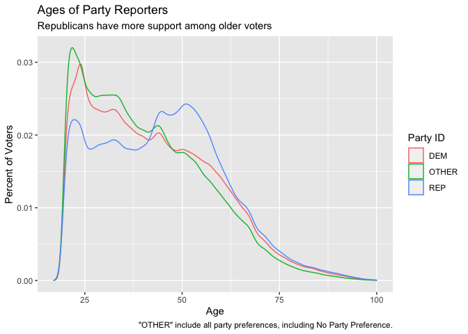

Experiments and Causality: Problem Set #4
================
Alex, Scott & Micah
12/9/2020

``` r
library(data.table)

library(sandwich)
library(lmtest)

library(stargazer)
library(ggplot2)
library(magrittr)

library(knitr)
```

# 1. Noncompliance in Recycling Experiment

Suppose that you want to conduct a study of recycling behavior. A number
of undergraduate students are hired to walk door to door and provide
information about the benefits of recycling to people in the treatment
group. Here are some facts about how the experiment was actually carried
out.

-   1,500 households are assigned to the treatment group.
-   The undergrads tell you that they successfully managed to contact
    700 households.
-   The control group had 3,000 households (not contacted by any
    undergraduate students).
-   The subsequent recycling rates (i.e. the outcome variable) are
    computed and you find that 500 households in the treatment group
    recycled. In the control group, 600 households recycled.

1.  What is the ITT? Do the work to compute it, and store it into the
    object `recycling_itt`.

``` r
recycling_itt <- (500/1500) - (600/3000)
recycling_itt
```

    ## [1] 0.1333333

2.  What is the CACE? Do the work to compute it, and store it into the
    object `recycling_cace`.

``` r
recycling_cace <- recycling_itt/(700/1500)
recycling_cace
```

    ## [1] 0.2857143

There appear to be some inconsistencies regarding how the undergraduates
actually carried out the instructions they were given.

-   One of the students, Mike, tells you that they actually lied about
    the the number of contacted treatment households and that the true
    number was 500.
-   Another student, Andy, tells you that the true number was
    actually 600.

3.  What is the CACE if Mike is correct?

``` r
cace_mike <- recycling_itt/(500/1500)
cace_mike
```

    ## [1] 0.4

4.  What is the CACE if Andy is correct?

``` r
cace_andy <- recycling_itt/(600/1500)
cace_andy
```

    ## [1] 0.3333333

For the rest of this question, suppose that **in fact** Mike was telling
the truth.

5.  What was the impact of the undergraduates’s false reporting on our
    estimates of the treatment’s effectiveness?

> **Answer: That will underestimate the true CACE, because the CACE
> calculated from Mike’s is larger.**

6.  Does your answer change depending on whether you choose to focus on
    the ITT or the CACE?

> **Answer: Yes the answer will change. Because ITT is not impacted by
> the take-out rat, but CACE is a fraction of ITT and take-out rates.
> Take-out rates is impacted by the number of compliers in experimental
> studies, so that impacts CACE too. **

# 2. Fun with the placebo

The table below summarizes the data from a political science experiment
on voting behavior. Subjects were randomized into three groups: a
baseline control group (not contacted by canvassers), a treatment group
(canvassers attempted to deliver an encouragement to vote), and a
placebo group (canvassers attempted to deliver a message unrelated to
voting or politics).

| Assignment | Treated? |    N | Turnout |
|:-----------|:---------|-----:|--------:|
| Baseline   | No       | 2463 |  0.3008 |
| Treatment  | Yes      |  512 |  0.3890 |
| Treatment  | No       | 1898 |  0.3160 |
| Placebo    | Yes      |  476 |  0.3002 |
| Placebo    | No       | 2108 |  0.3145 |

## Evaluating the Placebo Group

1.  Construct a data set that would reproduce the table. (Too frequently
    we receive data that has been summarized up to a level that is
    unuseful for our analysis. Here, we’re asking you to “un-summarize”
    the data to conduct the rest of the analysis for this question.)

``` r
nrow <- sum(summary_table$N)
d <- data.table(
  id = 1:sum(summary_table$N)
)
d[1:2463, `:=` (assignment = 'Baseline', treated = 0, turnout = c(rep(0, 1723), rep(1, 740)))]
d[2464: sum(2463, 512), `:=` (assignment = 'Treatment', treated = 1, turnout = c(rep(0, 313), rep(1, 199)))]
d[2976: sum(2463, 512, 1898), `:=` (assignment = 'Treatment', treated = 0, turnout = c(rep(0, 1298), rep(1, 600)))]
d[4873 : sum(2463, 512, 1898, 476), `:=` (assignment = 'Placebo', treated = 1, turnout = c(rep(0, 334), rep(1, 143)))]
d[sum(2463, 512, 1898, 476, 1):.N, `:=` (assignment = 'Placebo', treated = 0, turnout = c(rep(0, 1445), rep(1, 663)))]
# d[, .(N = .N, Turnout = mean(turnout)), by = list(assignment, treated)]
```

2.  Estimate the proportion of compliers by using the data on the
    treatment group.

``` r
complier_assign <- d[assignment == 'Treatment' & treated == 1, .N]
total_treatment <- d[assignment == 'Treatment', .N]
compliance_rate_t <- complier_assign/total_treatment
compliance_rate_t
```

    ## [1] 0.2125363

3.  Estimate the proportion of compliers by using the data on the
    placebo group.

``` r
compliance_rate_p <- d[assignment == 'Placebo' & treated == 1, .N]/d[assignment == 'Placebo', .N]
compliance_rate_p
```

    ## [1] 0.1845261

4.  Are the proportions in parts (1) and (2) statistically significantly
    different from each other? Provide *a test* and n description about
    why you chose that particular test, and why you chose that
    particular set of data.

``` r
proportions_difference_test <- prop.test(
  x = c(d[assignment == 'Treatment' & treated == 1, .N], d[assignment == 'Placebo' & treated == 1, .N]),
  n = c(d[assignment == 'Treatment', .N], d[assignment == 'Placebo', .N]))
  
proportions_difference_test
```

    ## 
    ##  2-sample test for equality of proportions with continuity correction
    ## 
    ## data:  c(d[assignment == "Treatment" & treated == 1, .N], d[assignment == "Placebo" & treated == 1, .N]) out of c(d[assignment == "Treatment", .N], d[assignment == "Placebo", .N])
    ## X-squared = 5.9849, df = 1, p-value = 0.01443
    ## alternative hypothesis: two.sided
    ## 95 percent confidence interval:
    ##  0.005461982 0.050558438
    ## sample estimates:
    ##    prop 1    prop 2 
    ## 0.2125363 0.1845261

> **Answer: I choose a two proportions z test because we are comparing
> two observed samples and the sample is large enough to apply central
> limit theorem. The null hypothesis is compliers in treatment
> assignment is equal to the compliers in placebo assignment. With a
> p-value of 0.014429, they are statistically different and we reject
> the null hypothesis at 5% significance level.**

5.  What critical assumption does this comparison of the two groups’
    compliance rates test? Given what you learn from the test, how do
    you suggest moving forward with the analysis for this problem?

> **Answer: One of the critial assumptions is that the percentage of
> compliers in the treatment group is same as that in the placebo.
> However, from answers above, we can see that the compliance rate in
> treatment group and placebo group is statistically significant. I
> would suggest investigating the root cause which caused the
> non-compliance across groups moving forward**

6.  Estimate the CACE of receiving the placebo. Is the estimate
    consistent with the assumption that the placebo has no effect on
    turnout?

``` r
itt <- (d[assignment == "Placebo" & turnout == 1, .N]/d[assignment == "Placebo", .N]) - (d[assignment == "Baseline" & turnout == 1, .N]/d[assignment == "Baseline", .N])
itt_d <- (d[assignment == "Placebo" & treated == 1, .N]/d[assignment == "Placebo", .N])
cace_estimate <- itt/itt_d


cace_estimate <- ((d[assignment == "Placebo", mean(turnout)])-(d[assignment == "Baseline", mean(turnout)]))/(d[assignment == "Placebo" & treated == 1, .N]/d[assignment == "Placebo", .N])
cace_estimate
```

    ## [1] 0.06152099

> **Answer: The placebo has some impact on ATE so it is not consistent
> with the assumption. If there were no effect we’d espect the estimate
> to be closer to 0. **

## Estimate the CACE Several Ways

7.  Using a difference in means (i.e. not a linear model), compute the
    ITT using the appropriate groups’ data. Then, divide this ITT by the
    appropriate compliance rate to produce an estiamte the CACE.

``` r
itt <- ((d[assignment == "Treatment", mean(turnout)])-(d[assignment == "Baseline", mean(turnout)]))
cace_means <- itt/(d[assignment == "Treatment", mean(treated)])
cace_means
```

    ## [1] 0.144969

8.  Use two separate linear models to estimate the CACE of receiving the
    treatment by first estimating the ITT and then dividing by
    *I**T**T*<sub>*D*</sub>. Use the `coef()` extractor and in line code
    evaluation to write a descriptive statement about what you learn
    after your code.

``` r
itt_model <- d[assignment == 'Treatment'|assignment == 'Baseline', lm(turnout ~ assignment)]
itt_d_model <- d[, lm(treated ~ assignment)]
cace_model_estimate <- coef(itt_model)[2]/coef(itt_d_model)[3] #check why 3 not 2
cace_model_estimate
```

    ## assignmentTreatment 
    ##            0.144969

**Answer: Estimating CACE using linear models gives the same results as
estimating the CACE using the difference in means from above.And there
is some causal effect of treatment on turnout.** 9. When a design uses a
placebo group, one additional way to estiamte the CACE is possible –
subset to include only compliers in the treatment and placebo groups,
and then estimate a linear model. Produce that estimate here.

``` r
cace_subset_model <- d[assignment != 'Baseline' & treated == 1, lm(turnout ~ assignment)]
cace_subset_model
```

    ## 
    ## Call:
    ## lm(formula = turnout ~ assignment)
    ## 
    ## Coefficients:
    ##         (Intercept)  assignmentTreatment  
    ##             0.29979              0.08888

10. In large samples (i.e. “in expectation”) when the design is carried
    out correctly, we have the expectation that the results from 7, 8,
    and 9 should be the same. Are they? If so, does this give you
    confidence that these methods are working well. If not, what
    explains why these estimators are producing different estimates?

> **Answer: The results for 7 and 8 are the same but they are different
> from 9. I think the result from 9 is different might because it is
> utilizing the placebo set instead of the baseline. The difference in
> the compliance rate between the placebo group and the treatment group
> is the source of the issue.**

# 4. Another Turnout Question

We’re sorry; it is just that the outcome and treatment spaces are so
clear!

This question allows you to scope the level of difficulty that you want
to take on.

-   If you keep the number of rows at 100,000 this is pretty
    straightforward, and you should be able to complete your work on the
    r.datahub.
-   But, the real fun is when you toggle on the full dataset; in the
    full dataset there are about 4,000,000 rows that you have to deal
    with. This is too many to work on the r.datahub. But if you’re
    writing using `data.table` and use a docker image or a local install
    either on your own laptop or a cloud provider, you should be able to
    complete this work.

Hill and Kousser (2015) report that it is possible to increase the
probability that someone votes in the California *Primary Election*
simply by sending them a letter in the mail. This is kind of surprising,
because who even reads the mail anymore anyways? (Actually, if you talk
with folks who work in the space, they’ll say, “We know that everybody
throws our mail away; we just hope they see it on the way to the
garbage.”)

Can you replicate their findings? Let’s walk through them.

``` r
# number_of_rows <- 100000
number_of_rows <- Inf

# d <- data.table::fread(
#   input = 'https://people.ischool.berkeley.edu/~d.alex.hughes/data/hill_kousser_analysisFile.csv', 
#   nrows = number_of_rows)

d<- readRDS(file = '/Users/mac/Desktop/W241/problem-set-4-Sarah-Yifei-Wang-main/q4_data.rds')
setDT(d)
```

(As an aside, you’ll note that this takes some time to download. One
idea is to save a copy locally, rather than continuing to read from the
internet. One problem with this idea is that you might be tempted to
make changes to this canonical data; changes that wouldn’t be reflected
if you were to ever pull a new copy from the source tables. One method
of dealing with this is proposed by [Cookiecutter data
science](https://drivendata.github.io/cookiecutter-data-science/#links-to-related-projects-and-references).)

Here’s what is in that data.

-   `age.bin` a bucketed, descriptive, version of the `age.in.14`
    variable
-   `party.bin` a bucketed version of the `Party` variable
-   `in.toss.up.dist` whether the voter lives in a district that often
    has close races
-   `minority.dist` whether the voter lives in a majority minority
    district, i.e. a majority black, latino or other racial/ethnic
    minority district
-   `Gender` voter file reported gender
-   `Dist1-8` congressional and data districts
-   `reg.date.pre.08` whether the voter has been registered since before
    2008
-   `vote.xx.gen` whether the voter voted in the `xx` general election
-   `vote.xx.gen.pri` whether the voter voted in the `xx` general
    primary election
-   `vote.xx.pre.pri` whether the voter voted in the `xx` presidential
    primary election
-   `block.num` a block indicator for blocked random assignment.
-   `treatment.assign` either “Control”, “Election Info”, “Partisan
    Cue”, or “Top-Two Info”
-   `yvar` the outcome variable: did the voter vote in the 2014 primary
    election

These variable names are horrible. Do two things:

-   Rename the smallest set of variables that you think you might use to
    something more useful. (You can use `data.table::setnames` to do
    this.)
-   For the variables that you think you might use; check that the data
    makes sense;

When you make these changes, take care to make these changes in a way
that is reproducible. In doing so, ensure that nothing is positional
indexed, since the orders of columns might change in the source data).

While you’re at it, you might as well also modify your `.gitignore` to
ignore the data folder. Because you’re definitely going to have the data
rejected when you try to push it to github. And every time that happens,
it is a 30 minute rabbit hole to try and re-write git history.

``` r
# setnames(
#   x = d,
#   old = c("age.in.14", "Party", "Gender", "block.num", "treatment.assign", "yvar"),
#   new = c("age",       "party", "gender", "block",     "treatment",        "vote")
# )
```

``` r
three_party_labeler <- function(x) { 
  Party <- ifelse(
    x == 'DEM', 'DEM', 
    ifelse(
      x == 'REP', 'REP', 
      'OTHER'))
  return(Party)
}

d[ , three_party := three_party_labeler(Party)]
```

``` r
d[ , treatment_f := factor(treatment.assign)]
d[ , any_letter  := treatment_f != 'Control' ]
```

Let’s start by showing some of the features about the data. There are
3,872,268 observations. Of these, 1,648,683 identify as Democrats
(42.576676 percent); 934,392) identify as Republicans (24.1303546
percent); and, 1,289,193) neither identify as Democrat or Republican
(33.2929694 percent).

``` r
d %>% 
  ggplot() + 
  aes(x = age.in.14, color = three_party) + 
  geom_density() + 
  scale_x_continuous(limits = c(17, 100)) + 
  labs(
    title = 'Ages of Party Reporters', 
    subtitle = 'Republicans have more support among older voters', 
    x = 'Age', y = 'Percent of Voters', 
    color = 'Party ID', 
    caption = '"OTHER" include all party preferences, including No Party Preference.'
  ) 
```

    ## Warning: Removed 6392 rows containing non-finite values (stat_density).

<!-- -->

## Some questions!

1.  **A Simple Treatment Effect**: Load the data and estimate a `lm`
    model that compares the rates of turnout in the control group to the
    rate of turnout among anybody who received *any* letter. This model
    combines all the letters into a single condition – “treatment”
    compared to a single condition “control”. Report robust standard
    errors, and include a narrative sentence or two after your code.

``` r
library(lmtest)
library(sandwich)
library(stargazer)
library("data.table")
setDT(d)
d <- d[, base_assignment := ifelse(treatment.assign=="Control", 0, 1)]
d[base_assignment ==1, mean(yvar)] - d[base_assignment ==0, mean(yvar)]
```

    ## [1] 0.004899234

``` r
d[base_assignment ==1, mean(yvar)]
```

    ## [1] 0.09802401

``` r
d[base_assignment ==0, mean(yvar)]
```

    ## [1] 0.09312478

``` r
model_simple <-  d[, lm(yvar ~ base_assignment)]
summary(model_simple)$coefficients
```

    ##                    Estimate   Std. Error    t value     Pr(>|t|)
    ## (Intercept)     0.093124777 0.0001507552 617.721690 0.000000e+00
    ## base_assignment 0.004899234 0.0007669995   6.387532 1.686031e-10

``` r
rse <- coeftest(model_simple, vcov = vcovHC(model_simple, type="HC1"))

rse
```

    ## 
    ## t test of coefficients:
    ## 
    ##                   Estimate Std. Error  t value  Pr(>|t|)    
    ## (Intercept)     0.09312478 0.00015062 618.2813 < 2.2e-16 ***
    ## base_assignment 0.00489923 0.00078340   6.2538 4.006e-10 ***
    ## ---
    ## Signif. codes:  0 '***' 0.001 '**' 0.01 '*' 0.05 '.' 0.1 ' ' 1

``` r
stargazer(
          model_simple, 
          se = rse, 
          type='text',
          add.lines =list(c('SE','Robust')),
          column.labels = c("model1"),
          header = F
          )
```

    ## 
    ## ===============================================
    ##                         Dependent variable:    
    ##                     ---------------------------
    ##                                yvar            
    ##                               model1           
    ## -----------------------------------------------
    ## base_assignment                0.005           
    ##                                                
    ##                                                
    ## Constant                       0.093           
    ##                               (0.093)          
    ##                                                
    ## -----------------------------------------------
    ## SE                            Robust           
    ## Observations                 3,872,268         
    ## R2                            0.00001          
    ## Adjusted R2                   0.00001          
    ## Residual Std. Error    0.291 (df = 3872266)    
    ## F Statistic         40.801*** (df = 1; 3872266)
    ## ===============================================
    ## Note:               *p<0.1; **p<0.05; ***p<0.01

> **Answer: ATE of control is 0.0931248. ATE of treatment is 0.098024
> Total treatment effect is 0.0048992 Robust standard errors is
> 0.0931248, 0.0048992, 1.5061878^{-4}, 7.833987^{-4}, 618.2813249,
> 6.2538198, 0, 4.0057465^{-10}. The impact of treatment has an ATE of
> 0.098024. It is statistically significant with a p-value of
> 1.6860314^{-10}). **

2.  **Specific Treatment Effects**: Suppose that you want to know
    whether different letters have different effects. To begin, what are
    the effects of each of the letters, as compared to control? Estimate
    an appropriate linear model and use robust standard errors.

``` r
model2 <- d[, lm(yvar ~ as.factor(treatment.assign))]
summary(model2)$coefficients
```

    ##                                             Estimate   Std. Error    t value
    ## (Intercept)                              0.093124777 0.0001507553 617.721547
    ## as.factor(treatment.assign)Election info 0.004984642 0.0016893106   2.950696
    ## as.factor(treatment.assign)Partisan      0.005259706 0.0011984120   4.388896
    ## as.factor(treatment.assign)Top-two info  0.004496100 0.0011984416   3.751623
    ##                                              Pr(>|t|)
    ## (Intercept)                              0.000000e+00
    ## as.factor(treatment.assign)Election info 3.170605e-03
    ## as.factor(treatment.assign)Partisan      1.139304e-05
    ## as.factor(treatment.assign)Top-two info  1.756964e-04

``` r
rse <- coeftest(model2, vcov = vcovHC(model2, type="HC1"))
rse
```

    ## 
    ## t test of coefficients:
    ## 
    ##                                            Estimate Std. Error  t value
    ## (Intercept)                              0.09312478 0.00015062 618.2812
    ## as.factor(treatment.assign)Election info 0.00498464 0.00172728   2.8858
    ## as.factor(treatment.assign)Partisan      0.00525971 0.00122664   4.2879
    ## as.factor(treatment.assign)Top-two info  0.00449610 0.00122248   3.6779
    ##                                           Pr(>|t|)    
    ## (Intercept)                              < 2.2e-16 ***
    ## as.factor(treatment.assign)Election info 0.0039039 ** 
    ## as.factor(treatment.assign)Partisan      1.804e-05 ***
    ## as.factor(treatment.assign)Top-two info  0.0002352 ***
    ## ---
    ## Signif. codes:  0 '***' 0.001 '**' 0.01 '*' 0.05 '.' 0.1 ' ' 1

``` r
stargazer(
          model2, 
          se = rse, 
          type='text',
          add.lines =list(c('SE','Robust')),
          column.labels = c("model2"),
          header = F
          )
```

    ## 
    ## ====================================================================
    ##                                              Dependent variable:    
    ##                                          ---------------------------
    ##                                                     yvar            
    ##                                                    model2           
    ## --------------------------------------------------------------------
    ## as.factor(treatment.assign)Election info            0.005           
    ##                                                                     
    ##                                                                     
    ## as.factor(treatment.assign)Partisan                 0.005           
    ##                                                                     
    ##                                                                     
    ## as.factor(treatment.assign)Top-two info             0.004           
    ##                                                                     
    ##                                                                     
    ## Constant                                            0.093           
    ##                                                    (0.093)          
    ##                                                                     
    ## --------------------------------------------------------------------
    ## SE                                                 Robust           
    ## Observations                                      3,872,268         
    ## R2                                                 0.00001          
    ## Adjusted R2                                        0.00001          
    ## Residual Std. Error                         0.291 (df = 3872264)    
    ## F Statistic                              13.670*** (df = 3; 3872264)
    ## ====================================================================
    ## Note:                                    *p<0.1; **p<0.05; ***p<0.01

**Answer: The coefficient for each one of the treatments is very small
so it is hard to confirm if any specific letter is much more effective
than any other**

3.  Does the increased flexibilitiy of a different treatment effect for
    each of the letters improve the performance of the model? Test,
    using an F-test. What does the evidence suggest, and what does this
    mean about whether there **are** or **are not** different treatment
    effects for the different letters?

``` r
# anova()
anova <- anova(model_simple, model2, test='F')
anova
```

    ## Analysis of Variance Table
    ## 
    ## Model 1: yvar ~ base_assignment
    ## Model 2: yvar ~ as.factor(treatment.assign)
    ##    Res.Df    RSS Df Sum of Sq      F Pr(>F)
    ## 1 3872266 327616                           
    ## 2 3872264 327616  2  0.017723 0.1047 0.9006

> **Answer: The p-value is not statistically significant at the 5%
> confidence level, we cannot deduce that the increased flexibilitiy
> improves the performance of the model. Both models have similiar
> statistical power and are not statistically significant. **

4.  **More Specific Treatment Effects** Is one message more effective
    than the others? The authors have drawn up this design as a
    full-factorial design. Write a *specific* test for the difference
    between the *Partisan* message and the *Election Info* message.
    Write a *specific* test for the difference between *Top-Two Info*
    and the *Election Info* message. Report robust standard errors on
    both tests and include a short narrative statement after your
    estimates.

``` r
model4_par = d[treatment.assign=='Partisan' | treatment.assign=='Election info', lm(yvar~ treatment.assign)]
model4_par_se = coeftest(model4_par, vcov = vcovHC(model4_par))
model4_par_se
```

    ## 
    ## t test of coefficients:
    ## 
    ##                            Estimate Std. Error t value Pr(>|t|)    
    ## (Intercept)              0.09810942 0.00172076 57.0152   <2e-16 ***
    ## treatment.assignPartisan 0.00027506 0.00210785  0.1305   0.8962    
    ## ---
    ## Signif. codes:  0 '***' 0.001 '**' 0.01 '*' 0.05 '.' 0.1 ' ' 1

``` r
model4_top_two = d[treatment.assign=='Top-two info' | treatment.assign=='Election info', lm(yvar~ treatment.assign)]
model4_top_two_se = coeftest(model4_top_two, vcov = vcovHC(model4_top_two))
model4_top_two_se
```

    ## 
    ## t test of coefficients:
    ## 
    ##                                 Estimate  Std. Error t value Pr(>|t|)    
    ## (Intercept)                   0.09810942  0.00172076  57.015   <2e-16 ***
    ## treatment.assignTop-two info -0.00048854  0.00210543  -0.232   0.8165    
    ## ---
    ## Signif. codes:  0 '***' 0.001 '**' 0.01 '*' 0.05 '.' 0.1 ' ' 1

**Answer: The robust standard errors for Partisan treament is 0.0021078.
The robust standard errors for Top-Two Info treament is 0.0021054. None
of the models is statistically significant. So we cannot conclude if noe
message is more effective than the others**

5.  **Blocks? We don’t need no stinking blocks?** The blocks in this
    data are defined in the `block.num` variable (which you may have
    renamed). There are a *many* of blocks in this data, none of them
    are numerical – they’re all category indicators. How many blocks are
    there?

``` r
block_num <-d[, .N, by = block.num][, .N]
```

> So many blocks! There are 382 if we count them all.

**Answer: There are 382 blocksxs**

6.  **SAVE YOUR CODE FIRST** but then try to estimate a `lm` that
    evaluates the effect of receiving *any letter*, and includes this
    block-level information. What happens? Why do you think this
    happens? If this estimate *would have worked* (that’s a hint that we
    don’t think it will), what would the block fixed effects have
    accomplished?

``` r
##
## SAVE YOUR CODE: before you run the next lines, because it's going 
##                 to crash you if you're on the r.datahub.
##                 ... but why does it crash you?
## 

##model_block_fx  <- d[ , .(vote, any_letter, block)][ , lm(vote ~ any_letter + factor(block))]
# Error: vector memory exhausted (limit reached?)
```

**Answer: We are able to see if different blocks have any impact on
voter turnout. But this includes lots of blocks so it is hard to draw
any meaningful conclusion.** 6. Even though we can’t estimate this fixed
effects model directly, we can get the same information and model
improvement if we’re *just a little bit clever*. Create a new variable
that is the *average turnout within a block* and attach this back to the
data.table. Use this new variable in a regression that regresses voting
on `any_letter` and this new `block_average`. Then, using an F-test,
does the increased information from all these blocks improve the
performance of the *causal* model? Use an F-test to check.

``` r
d[, avg_block_turnout := mean(yvar), keyby =block.num ]
model6 <- d[, lm(yvar~ base_assignment + avg_block_turnout)]
coeftest(model6, vcov = vcovHC(model6))
```

    ## 
    ## t test of coefficients:
    ## 
    ##                      Estimate  Std. Error  t value  Pr(>|t|)    
    ## (Intercept)       -0.00019035  0.00030036  -0.6338    0.5262    
    ## base_assignment    0.00492381  0.00076824   6.4092 1.463e-10 ***
    ## avg_block_turnout  1.00000141  0.00343214 291.3641 < 2.2e-16 ***
    ## ---
    ## Signif. codes:  0 '***' 0.001 '**' 0.01 '*' 0.05 '.' 0.1 ' ' 1

``` r
f_test6<-anova(model_simple, model6, test = 'F')
f_test6
```

    ## Analysis of Variance Table
    ## 
    ## Model 1: yvar ~ base_assignment
    ## Model 2: yvar ~ base_assignment + avg_block_turnout
    ##    Res.Df    RSS Df Sum of Sq      F    Pr(>F)    
    ## 1 3872266 327616                                  
    ## 2 3872265 315228  1     12388 152170 < 2.2e-16 ***
    ## ---
    ## Signif. codes:  0 '***' 0.001 '**' 0.01 '*' 0.05 '.' 0.1 ' ' 1

**Answer: This could improve the model. P value from the test is
statistically significant. So the block fixed effect is predictive of
voter turnout** 7. Doesn’t this feel like using a bad-control in your
regression? Has the treatment coefficient changed from when you didn’t
include the `block_average` measure to when you did? Have the standard
errors on the treatment coefficient changed from when you didn’t include
the `block_average` measure to when you did? Why is this OK to do?

``` r
head(d[, .(mean(base_assignment)), by = .(block.num)], 20)
```

    ##     block.num         V1
    ##  1:         0 0.05045872
    ##  2:        27 0.03871448
    ##  3:        28 0.03863636
    ##  4:        29 0.03863060
    ##  5:        30 0.03867521
    ##  6:        31 0.03860268
    ##  7:        32 0.03846154
    ##  8:        33 0.03846154
    ##  9:        34 0.03846154
    ## 10:        35 0.03871673
    ## 11:        36 0.03846154
    ## 12:        37 0.03846154
    ## 13:        38 0.03846154
    ## 14:        39 0.03846154
    ## 15:        40 0.03846154
    ## 16:        41 0.03846154
    ## 17:        42 0.03846154
    ## 18:        43 0.03872218
    ## 19:        44 0.03870519
    ## 20:        45 0.03871625

> **Answer: I dont think it is a bad control because of the randomized
> block assignments. From the output above of means of the first 20
> blocks, The mean of each block is almost same. Therefore taking the
> mean of these blocks and regressing the model on those means is same
> as taking fixed blocks effects, because of the power of randomization.
> The treatment coefficient changed but to a very small degree. The
> standard errors on the treatment coefficient did not change. I think
> it is okay because they are not associated with both the outcome and
> the treatment. They are just associated with the outcome. Therefore,
> this does not open a back door pathway.**

``` r
# stargazer(
#   fill in with your models
#   type = 'text'
# )
```

``` r
setkeyv(x = d, cols = 'block.num')

d[block.num > 0 , .(
      prop_control  = mean(treatment_f == 'Control'), 
      prop_info     = mean(treatment_f == 'Election info'), 
      prop_top_two  = mean(treatment_f == 'Top-two info'), 
      prop_partisan = mean(treatment_f == 'Partisan')), 
    keyby = .(block.num)] %>% 
  melt(data = ., id.vars = 'block.num') %>% 
    ggplot() + 
      aes(x = block.num, y = value, color = variable) + 
      geom_point() + 
      facet_wrap(facets = vars(variable), nrow = 2, ncol = 2, scales = 'free')
```

<!-- -->

# Consider Designs

Determine the direction of bias in estimating the ATE for each of the
following situations when we randomize at the individual level. Do we
over-estimate, or underestimate? Briefly but clearly explain your
reasoning.

1.  Suppose that you’re advertising games – Among Us? – to try and
    increase sales, and you individually randomly-assign people into
    treatment and control. After you randomize, you learn that some
    treatment-group members are friends with control-group members IRL.

2.  As we’re writing this question, summer bonuses are being given out
    in people’s companies. (This is not a concept we have in the program
    – each day with your smiling faces is reward enough – and who needs
    money anyways?) Suppose that you’re interested in knowing whether
    this is a good idea from the point of view of worker productivity
    and so you agree to randomly assign bonuses to some people. *What
    might happen to your estimated treatment effects if people learn
    about the bonuses that others have received?*
